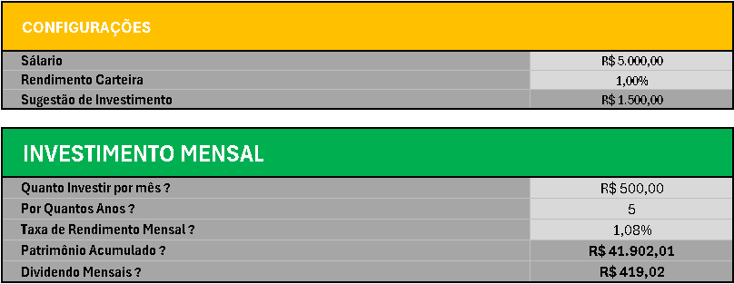

# Simulador de Investimentos em Fundos Imobiliários (FIIs)

Este projeto, desenvolvido como parte de um desafio da DIO, consiste em uma planilha Excel interativa projetada para simular investimentos em Fundos Imobiliários (FIIs). O objetivo é capacitar o usuário a tomar decisões financeiras mais informadas, oferecendo uma visão clara do potencial de retorno de seus investimentos.

---

## Índice

- [Como Funciona](#como-funciona)
- [Recursos da Planilha](#recursos-da-planilha)
  - [1. Seção de Configurações](#1-secao-de-configuracoes)
  - [2. Simulação de Investimento Mensal](#2-simulacao-de-investimento-mensal)
  - [3. Cenários de Simulação](#3-cenarios-de-simulacao)
  - [4. Perfil do Investidor e Distribuição de FIIs](#4-perfil-do-investidor-e-distribuicao-de-fiis)
  - [5. Gráfico de Pizza](#5-grafico-de-pizza)
- [Considerações Finais](#consideracoes-finais)
- [Contribuições](#contribuicoes)

---

## 🚀 Como Funciona

A planilha foi concebida para ser **prática** e **altamente automatizada**, minimizando a necessidade de entradas manuais e focando em cálculos complexos de forma eficiente.

### Entradas do Usuário

Você só precisa preencher alguns campos para iniciar sua simulação:

* **Salário:** Para referência e cálculo de sugestão de investimento.
* **Rendimento Carteira:** A taxa de rendimento mensal esperada para sua carteira de FIIs.
* **Quanto Investir por mês?:** O valor do aporte mensal que você planeja fazer.
* **Por Quantos Anos?:** O horizonte de tempo em anos para a sua simulação.
* **PERFIL:** Selecione seu perfil de investidor em uma lista: **Conservador**, **Moderado** ou **Agressivo**.

---

## ✨ Recursos da Planilha

### 1. Seção de Configurações

Defina os parâmetros iniciais da simulação:

| Parâmetro                   | Valor         | Observações                                    |
|-----------------------------|---------------|------------------------------------------------|
| **Salário**                 | R$ 5.000,00   | Valor base para a simulação                    |
| **Rendimento Carteira**     | 1,00%         | Taxa de retorno dos investimentos            |
| **Sugestão de Investimento**| R$ 1.500,00   | Aproximadamente 30% do salário                 |

> **Nota:** Estes parâmetros servem como ponto de partida para a configuração inicial da sua simulação.

---

### 2. Simulação de Investimento Mensal

Insira seus dados de investimento para visualizar as projeções dos resultados:

- **Quanto Investir por Mês?** R$ 500,00  
- **Por Quantos Anos?** 5  
- **Taxa de Rendimento Mensal:** 1,08%  
- **Patrimônio Acumulado:** R$ 41.902,01  
  *Calculado utilizando a função `VF` do Excel, considerando os aportes mensais e os juros compostos.*  
- **Dividendos Mensais:** R$ 419,02  
  *Derivado do patrimônio acumulado multiplicado pela taxa de rendimento.*

> **Dica:** A função `VF` permite calcular o valor futuro dos investimentos, sendo essencial para projeções financeiras realistas.

### Imagem Ilustrativa

Esta imagem integra os conceitos das duas primeiras seções (Configurações e Simulação):

---

### 3. Cenários de Simulação

Visualize rapidamente o potencial de crescimento do seu investimento em diferentes horizontes de tempo:

| Anos | Quanto em X Anos?  | Dividendos   |
| :--- | :----------------: | :---------:  |
| 2    | R$ 13.615,43       | R$ 136,15    |
| 5    | R$ 41.902,01       | R$ 419,02    |
| 10   | R$ 121.728,83      | R$ 1.217,29  |
| 20   | R$ 563.524,50      | R$ 5.635,24  |
| 30   | R$ 2.166.952,41    | R$ 21.669,52 |

*As projeções de patrimônio e dividendos são calculadas automaticamente para cada período, utilizando a mesma lógica da seção de simulação principal.*

#### Imagem: Cenários de Simulação

---

### 4. Perfil do Investidor e Distribuição de FIIs

Esta seção adapta a alocação de acordo com o seu perfil, oferecendo uma análise detalhada e dinâmica da distribuição de FIIs:

- **PERFIL:** `MODERADO` *(selecionado via validação de dados em lista)*  
- **VALOR A SER INVESTIDO POR MÊS:** `R$ 500,00` *(puxa o valor definido na seção de simulação)*

| Tipo de FII       | Porcentual Sugerido | Valores     |
| :---------------- | :------------------ | :---------: |
| PAPEL             | 32%                 | R$ 160,00   |
| TIJOLO            | 40%                 | R$ 200,00   |
| HIBRIDOS          | 8%                  | R$ 40,00    |
| FOFs              | 10%                 | R$ 50,00    |
| DESENVOLVIMENTO   | 5%                  | R$ 25,00    |
| HOTELARIAS        | 5%                  | R$ 25,00    |
| **Total**         | **100%**            | **R$ 500,00** |

*Lógica:* A coluna "Porcentual Sugerido" é **dinâmica**, ajustando-se automaticamente com base no perfil selecionado, por meio de funções como `PROCV`, e a coluna "Valores" calcula o montante em reais para cada tipo de FII.

#### Imagem: Perfil do Investidor e Distribuição de FIIs

---

### 5. Gráfico de Pizza

Esta seção apresenta uma representação visual da alocação dos FIIs através de um gráfico de pizza, que se **atualiza automaticamente** conforme as porcentagens sugeridas pelo `PERFIL` selecionado.

#### Imagem: Gráfico de Pizza

---

Este simulador oferece uma ferramenta completa para planejar e visualizar o crescimento dos seus investimentos em Fundos Imobiliários de forma prática e intuitiva.

---

## Considerações Finais

Este é um projeto de curso, criado como parte de um desafio da DIO. O simulador, embora prático e intuitivo, ainda está em uma fase básica e precisa de diversos ajustes ao longo do tempo para evoluir. O conteúdo aqui apresentado é superficial, mas cumpre o objetivo de facilitar o planejamento financeiro para investimentos em FIIs.

---

## Contribuições

Se você encontrou algum problema ou tem sugestões de melhoria, sinta-se à vontade para enviar *pull requests* ou abrir *issues*.

---
